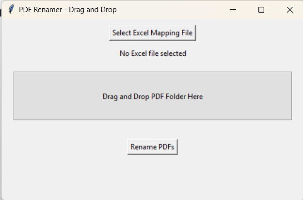

# 🗂️ PDF Renamer GUI

A Python GUI tool to rename 300–1000 PDF files based on values from an Excel spreadsheet.  
Supports drag-and-drop functionality for fast and efficient file handling.

[](https://www.python.org/)
[]()
[](LICENSE)

---

## 🚀 Features

- ✅ Rename large batches of PDF files (300–1000+)
- 📥 Drag-and-drop support
- 📊 Reads mapping from Excel (.xlsx)
- 🖥️ Simple GUI with Tkinter

---

## 📦 Requirements

Install dependencies:

```bash
pip install -r requirements.txt

🛠️ How to Use
1. Clone this repo or download the ZIP.

2. Prepare your Excel file like this:

| Original Filename | New Filename   |
| ----------------- | -------------- |
| abc123.pdf        | Invoice001.pdf |
| xyz456.pdf        | Invoice002.pdf |

3. Run the app:
python pdf_renamer_gui.py

4. Drag and drop PDFs and Excel file into the app and click Rename.

🧠 Tech Stack
Python 🐍

Pandas

Tkinter

OpenPyXL

📷 Screenshot


📬 Contact
Questions or ideas? Email me at: arvin.balinado@yahoo.com

📄 License
This project is licensed under the MIT License.


👤 Author
Arvin Balinado
